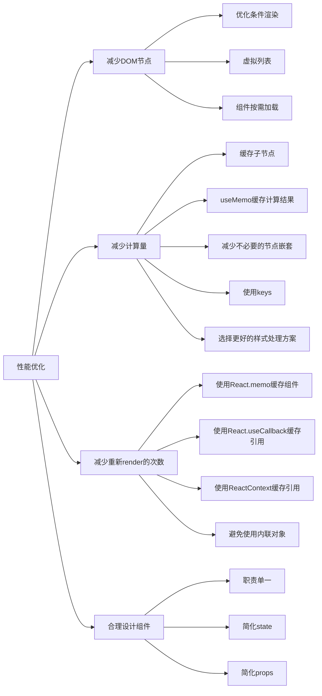

1. [Optimizing Performance – React 官网](https://react.docschina.org/docs/optimizing-performance.html)

```mermaid
graph LR
    性能优化 --> A[减少DOM节点]
    性能优化 --> B[减少计算量]
    性能优化 --> C[减少重新render的次数]
    性能优化 --> D[合理设计组件]
    A-->优化条件渲染
    A-->虚拟列表
    A-->组件按需加载
    B-->缓存子节点
    B-->useMemo缓存计算结果
    B-->减少不必要的节点嵌套
    B-->使用keys
    B-->选择更好的样式处理方案
    C-->使用React.memo缓存组件
    C-->使用React.useCallback缓存引用
    C-->使用ReactContext缓存引用
    C-->避免使用内联对象
    D-->职责单一
    D-->简化state
    D-->简化props
```
