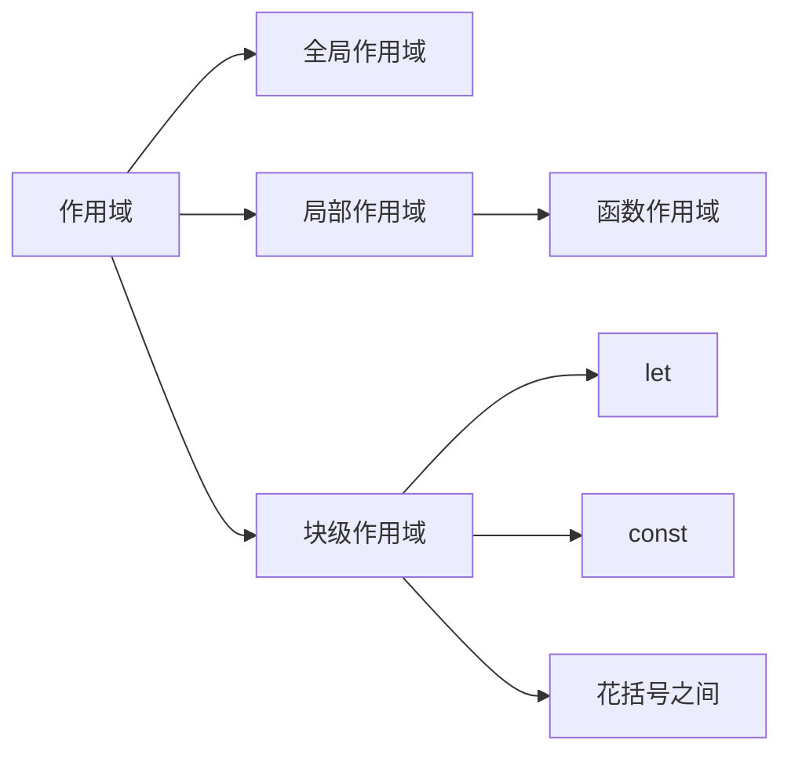

## 作用域

作用域是代码在运行时,某些特定部分中的变量,函数和对象的可访问性。换句话说，作用域
决定了变量与函数的可访问范围，即作用域控制着变量与函数的可见性和生命周期。

## 作用域链

当代码在一个环境中执行时，会创建变量对象的一个作用域链。作用域链的用途是保证对执
行环境有权访问的所有变量和函数的有序访问。

```javascript
var currentScope = 0; // global scope
(function () {
  var currentScope = 1,
    one = 'scope1';
  console.log(currentScope);
  (function () {
    var currentScope = 2,
      two = 'scope2';
    console.log(currentScope);
    (function () {
      var currentScope = 3,
        three = 'scope3';
      console.log(currentScope);
      console.log(one + two + three);
    })();
  })();
})();

// 1
// 2
// 3
// scope1scope2scope3
```

## 注意:变量提升

```javascript
var tmp = new Date();
function f() {
  console.log(tmp);
  if (false) {
    var tmp = 'hello';
  }
}
f(); // undefined
```

这道题应该很多小伙伴在面试中遇到过，有人会认为输出的是当前日期。但是正确的结果是
undefined。这就是由于变量提升造成的，在这里`申明提升了，定义的内容并不会提升`，
提升后对应的代码如下：

```javascript
var tmp = new Date();
function f() {
  var tmp;
  console.log(tmp);
  if (false) {
    tmp = 'hello';
  }
}
f();
```

console 在输出的时候，tmp 变量仅仅申明了但未定义。所以输出 undefined。虽然能够输
出，但是并不推荐这种写法推荐的做法是在申明变量的时候，将所用的变量都写在作用域（
全局作用域或函数作用域）的最顶上，这样代码看起来就会更清晰，更容易看出来哪个变量
是来自函数作用域的，哪个又是来自作用域链

!> 再看一个例子

```javascript
foo();
var foo = function () {
  console.log('1');
};

// TypeError: foo is not a function
```

## 同时提升

变量和函数同时出现的提升  
如果有函数和变量同时声明了，会出现什么情况呢？看下面但代码

```javascript
console.log(foo);
var foo = '123';
function foo() {}

// [Function: foo]
```

输出结果是 function foo(){},也就是函数内容

如果是另外一种形式呢？

```javascript
console.log(foo);
var foo = '123';
var foo = function () {};
// undefined
```

对两种结果进行分析说明：

第一种：函数申明。就是上面第一种，function foo(){}这种形式  
另一种：函数表达式。就是上面第二种，var foo=function(){}这种形式

第二种形式其实就是 var 变量的声明定义，因此上面的第二种输出结果为 undefined 应该
就能理解了。

而第一种函数申明的形式，在提升的时候，会被整个提升上去，包括函数定义的部分！因此
第一种形式跟下面的这种方式是等价的！

```javascript
var foo = function () {};
console.log(foo);
var foo = '123';
```

原因是：函数声明被提升到最顶上；申明只进行一次，因此后面 var foo='123'的申明会被
忽略。函数申明的优先级优于变量申明，且函数声明会连带定义一起被提升（这里与变量不
同）

---

1. [作用域与作用域链](https://xie.infoq.cn/article/f2bdf1ccba0c974803cf892d6)
